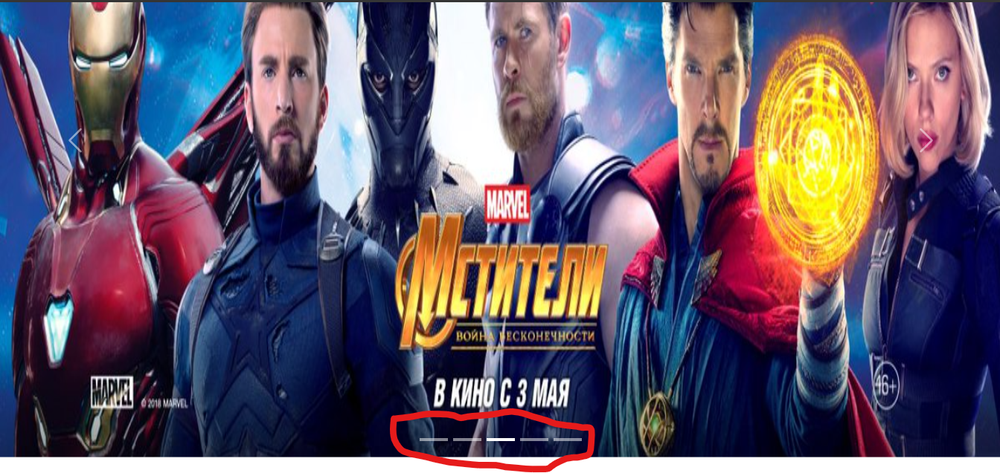

# COROUSEL EM BOOTSTRAP
🌹UTILIZANDO O FRAMEWORK BOOTSTRAP PARA EXIBIR IMAGENS EM CARROSSEL.

 <br>

## DESCRIÇÃO:
Este código HTML faz parte de uma página web que utiliza o framework Bootstrap para criar um componente de carrossel (carousel). Vamos analisar cada parte do código:

1. **Meta tags e Título:**
   - Inclui as meta tags para o conjunto de caracteres e visualização responsiva.
   - Define o título da página como "CFB Cursos - Curso de Bootstrap".

2. **Vinculação de Estilos e Scripts:**
   - Vincula o arquivo CSS do Bootstrap e adiciona alguns estilos customizados dentro da tag `<style>`.
   - Vincula o arquivo JavaScript do Bootstrap, que é necessário para o funcionamento de certos componentes, como o carrossel.

3. **Elementos HTML:**
   - `<h1>` e `<h3>`: Títulos para a página e uma breve descrição do que é um carrossel Bootstrap.
   - `<div id="banner" class="carousel slide" data-bs-ride="carousel">`: A div principal que contém o carrossel. `data-bs-ride="carousel"` indica que este é um carrossel e pode ser automaticamente percorrido.
   - `<div id="indicadores" class="carousel-indicators">`: Botões indicadores para cada slide do carrossel.
   - `<div id="imagens" class="carousel-inner">`: Contém os itens (imagens) a serem exibidos no carrossel.
   - `<button type="button" class="carousel-control-prev" data-bs-target="#banner" data-bs-slide="prev">` e `<button type="button" class="carousel-control-next" data-bs-target="#banner" data-bs-slide="next">`: Botões de controle para navegar pelos slides.

4. **Slides do Carrossel:**
   - Cada `<div class="carousel-item">` representa um slide do carrossel e contém uma imagem correspondente.

5. **Estilos CSS Customizados:**
   - Algumas regras de estilo adicionais são fornecidas diretamente no arquivo HTML usando a tag `<style>`. Isso inclui margens para os títulos, uma cor de fundo para o segundo título (`<h3>`), e uma altura fixa para as imagens.

6. **Scripts JavaScript Bootstrap:**
   - Vincula o arquivo JavaScript do Bootstrap, que é essencial para o funcionamento de componentes interativos, como o carrossel.

O carrossel exibirá as imagens (`b1.jpg`, `b2.jpg`, etc.) em sequência, com botões de controle e indicadores para navegação. O Bootstrap simplifica a criação de componentes responsivos e interativos, facilitando o desenvolvimento de páginas web modernas.

## COMO USAR?
* Clone o repositório para o seu sistema local:

```bash
git clone https://github.com/VILHALVA/COROUSEL-EM-BOOTSTRAP.git
```

* Navegue até o diretório do projeto.

```bash
cd COROUSEL-EM-BOOTSTRAP
```

* Descompacte o arquivo ZIP (se você baixou manualmente):

```bash
unzip COROUSEL-EM-BOOTSTRAP.zip
```
* Abra o arquivo `INDEX.html` em seu navegador de preferência.

## NÃO SABE?
- Entendemos que para manipular arquivos em `HTML`, `CSS` e outras linguagens relacionadas, é necessário possuir conhecimento nessas áreas. Para auxiliar nesse aprendizado, oferecemos cursos gratuitos disponíveis:
* [Curso de HTML e CSS](https://github.com/VILHALVA/CURSO-DE-HTML-E-CSS)
* [Curso de JavaScript](https://github.com/VILHALVA/CURSO-DE-JAVASCRIPT)
* [Curso de Bootstrap](https://github.com/VILHALVA/CURSO-DE-BOOTSTRAP)
* [Confira mais cursos](https://github.com/VILHALVA?tab=repositories&q=+topic:CURSO)

## CREDITOS:
- [PROJETO CRIADO PELO VILHALVA](https://github.com/VILHALVA)
